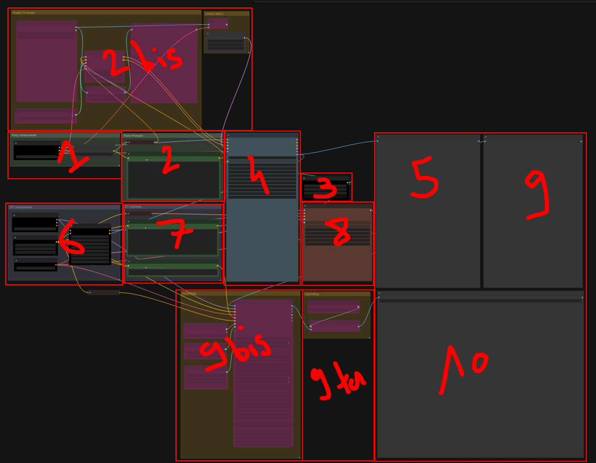

# Model Chain Workflow (ComfyUI) — `model_chain_v2`

A two-model image-generation pipeline for ComfyUI. It generates a first image
with a model that is **good at following the prompt**, then partially re-noises
that image and pushes it through a second model that is **good at realism**, so
you get the best of both. Optional "bis"/"ter" blocks let you do image-to-image,
fix faces, and upscale the final result.

This document is written for beginners. If you have never touched ComfyUI
before, read the **"The big idea"** section first — it gives you the mental
picture you need before the node-by-node tour makes sense.

---


## The big idea: why chain two models?

### A 30-second mental model of how these image generators work

An image model does **not** paint a picture stroke by stroke. It starts from a
canvas of pure random noise (TV static) and, step by step, *removes* noise until
a coherent image emerges. Think of it like a photo developing in a darkroom, or
a sculptor chipping a statue out of a block of marble: the picture was "hidden"
in the noise, and the model carves it out, guided by your text prompt.

Two ideas matter for this workflow:

- **Latent space.** The model does not work on pixels directly. It works on a
  small, compressed mathematical representation called a *latent*. A component
  called a **VAE** translates between pixels and latents (encode = pixels →
  latent, decode = latent → pixels). You can think of the latent as the "rough
  idea" of the image and the pixels as the "finished print."
- **Denoise strength.** When you start from an *existing* image instead of pure
  static, you can choose how much noise to add back before re-developing it.
  - `denoise = 1.0` → throw the image away, start from scratch.
  - `denoise = 0.0` → change nothing.
  - `denoise = 0.37` → keep ~63% of the original structure, regenerate ~37%.

That last number is the heart of this workflow.

### What "model chaining" means here

No single model is best at everything. One model nails **prompt adherence** — it
listens carefully to your description and gets the composition, the pose, the
objects, and the count of things right. Another model produces more convincing
**realism** — skin, lighting, textures — but is fussier about prompts.

So we chain them:

1. **Model A (prompt adherence)** generates the first image. It gets *what* is in
   the picture right.
2. We **re-encode** that image into latent space and add a controlled amount of
   noise back — the **re-noise threshold** (`denoise 0.37`).
3. **Model B (realism)** re-develops that partially-noised latent. Because most
   of the structure is preserved, Model B keeps the composition Model A built but
   re-renders it in its own, more realistic style.

The threshold is the key dial. Too low and Model B can't change much (you stay
in Model A's look). Too high and Model B forgets the composition Model A worked
out (you drift back to a fresh image). `0.37` is a tuned middle ground: enough
freedom to restyle, not so much that it loses the plot.

```
  Model A (prompt adherence)        bridge            Model B (realism)
  ┌───────────────────────┐                       ┌───────────────────────┐
  │ prompt + (optional)   │   image → VAE encode  │ re-noise to 0.37,     │
  │ ControlNet  ──► image │ ─────────► latent ───► │ then denoise again ──►│ image
  └───────────────────────┘                       └───────────────────────┘
        good at WHAT                                     good at HOW it looks
```

Everything else in the graph is either feeding these two models (loaders,
prompts, seeds) or polishing the output afterwards (face fixing, upscaling).

---

## Quick start (the minimal path)

If you just want a result and will explore later:

1. **Load the models** (boxes **1** and **6**) — make sure the checkpoint, CLIP,
   VAE, and LoRA file names point to files you actually have. See
   [Files you need](#files-you-need).
2. **Write the Pony prompt** (box **2**): keep the existing `score_9, score_8_up,
   score_7_up, BREAK,` prefix and add your **booru tags** after it. Leave the
   negative prompt as-is.
3. **Write the ZIT prompt** (box **7**): describe the same scene in natural
   language. Leave its negative blank.
4. Leave the seed (box **3**) and both samplers (boxes **4** and **8**) on their
   tuned defaults.
5. Press **Queue / Run**. Watch box **5** (Model A preview) and box **9** (Model B
   preview). Box **10** is your final saved image.

The "bis"/"ter" blocks (**2bis, 9bis, 9ter**) are optional extras you can ignore
on a first run.

---

## Section-by-section tour

The numbers below match the hand-drawn labels on `workflow_map.png`.

### 1 — Model A loader (prompt-adherence model)
*Group: "Pony components" · node: `CheckpointLoaderSimple`*

Loads the first model as an **all-in-one checkpoint**: it provides three things
at once — the **model** (the denoiser), the **CLIP** (the text-understanding
part), and the **VAE** (the pixel↔latent translator). Current file:
`ponyRealism_V22MainVAE.safetensors`.

A small helper, **CLIP Set Last Layer = -2** ("clip skip"), is attached to this
model's text encoder. This is a standard setting for Pony-style models that
tends to give cleaner results; leave it at `-2` unless you know why you'd change
it.

### 2 — Model A prompts (positive & negative)
*Group: "Pony Prompts" · nodes: two `CLIPTextEncode`*

This model speaks **booru tags** (short comma-separated keywords like
`1girl, outdoors, looking_at_viewer`).

- **Positive prompt:** the box already starts with
  `score_9, score_8_up, score_7_up, BREAK,`. **Keep that beginning** (it's a
  quality-boost convention for this model family) and **add your booru tags
  after it.**
- **Negative prompt:** already filled with a long list of quality/anatomy
  "don'ts". You normally leave this untouched.

### 2bis — Image-to-Image (optional bonus)
*Group: "Image To Image" · nodes: `LoadImage`, `Canny`, `ControlNetLoader`,
`ControlNetApplyAdvanced`, a `PreviewImage`, and a spare `VAEEncode`*

This block lets you **force similarity to a reference image** you downloaded.
Two mechanisms live here:

- **ControlNet (Canny).** Your reference image is run through a **Canny edge
  detector** (it traces the outlines), and those edges are fed to the Model A
  sampler as a structural guide. The preview node lets you see the detected
  edges. Current strength `0.4`, applied over the first `0–37%` of sampling, so
  it nudges the composition early without freezing the whole image. Tip: keep
  your **booru tags roughly matching** the reference, or the prompt and the edges
  will fight each other.
- **A spare `VAEEncode`** (in the "switch latent" group, left disconnected on
  purpose). To do "true" image-to-image you **rewire** ("décontourner") this
  node's latent output into the Model A sampler's `latent_image` input, *in place
  of* the Empty Latent. That makes the model start from your reference image
  rather than from blank noise.

Both are optional. If you do nothing here, the workflow runs as pure
text-to-image.

### 3 — Seed (shared by both main models)
*node: `Seed (rgthree)`*

The seed is the random starting point. Same seed + same settings = same image
(reproducible). This one seed feeds **both** Model A and Model B so the two
stages stay in sync. Set it to `-1` to randomize every run, or pin a number to
reproduce a result.

> Note: the **face-fixing** block (9bis) has its **own separate seed** (node in
> that group), so you can re-roll faces without changing the whole picture.

### 4 — Model A sampler (the generator)
*node: `KSampler Adv. (Efficient) - PONY` (+ an `EmptyLatentImage` for the canvas)*

This is where Model A actually generates the first image. It's **already tuned**:
~65 steps, CFG 6, `dpmpp_2m_sde` / `karras`, full denoise from blank noise. The
**Empty Latent Image** sets the canvas size (default `1024×1024`). You generally
don't touch this block — just let it run.

### 5 — Model A preview
*node: `PreviewImage` ("PONY OUTPUT")*

Shows the raw first image, straight out of Model A, **before** the realism pass.
Useful for checking that the composition/prompt came out right.

### 6 — Model B loader (realism model) + LoRAs
*Group: "ZIT components" · nodes: `CheckpointLoaderSimple`, `CLIPLoader`,
`VAELoader`, `Lora Loader Stack`*

The second model is loaded as **separate parts** (this is normal for newer
models):

- **Checkpoint** — the realism model itself (`z-image-turbo-fp8-e4m3fn.safetensors`).
- **CLIP** — a separate text encoder (`qwen_3_4b.safetensors`, Lumina2 type).
- **VAE** — `ae.safetensors` (this same VAE is used for the bridge encode and the
  final decode).
- **LoRA stack** — small add-on models that bias the style. Two are configured
  here. **Use only one at a time** (set the other's strength to `0`); stacking
  both tends to muddy the result. The first is enabled at strength `0.65` by
  default.

### 7 — Model B prompt (+ face prompt)
*Group: "ZIT prompts" · nodes: `CLIPTextEncode` ×2 for ZIT, plus the face prompt
nodes*

- **ZIT positive prompt:** describe the same scene, but in **natural language**
  (full sentences), since this model understands prose better than tags. Try to
  describe the *same* content you tagged in box 2 so the two stages agree.
- **ZIT negative prompt:** **leave it blank** — this model doesn't need one.
- **Face prompt:** also lives here (blank by default). It's only used by the
  optional face-fixing block (9bis) and only matters if you enable that.

### 8 — Model B sampler + the chain bridge
*node: `KSampler - ZIT` (+ the bridge `VAEEncode`)*

This is the second half of the chain. The **bridge `VAEEncode`** takes Model A's
finished image (box 5) and encodes it back into a latent. The ZIT sampler then
re-develops that latent at **denoise `0.37`** — the re-noise threshold described
in [The big idea](#the-big-idea-why-chain-two-models). It's **already tuned**
(turbo settings: ~10 steps, CFG 1, `euler` / `beta`).

**This `0.37` is the main creative dial of the whole workflow:**

- **Lower** (e.g. `0.25`) → stays closer to Model A's look, smaller realism change.
- **Higher** (e.g. `0.5`) → stronger realism restyle, but risks drifting away from
  the composition Model A built.

### 9 — Model B preview
*node: `PreviewImage` ("ZIT OUTPUT")*

Shows the image **after** the realism pass — i.e. the core result of the model
chain, before optional face fixing and upscaling.

### 9bis — Face fixing (optional bonus)
*Group: "Face fixes" · nodes: `FaceDetailer`, `UltralyticsDetectorProvider`,
`SAMLoader`, a dedicated `Seed`*

Faces often come out worst because they're small relative to the whole image.
This block **detects each face, crops it, regenerates it at higher resolution,
and pastes it back** sharper. It uses a YOLO face detector + SAM masking, the
Model B checkpoint, and the **face prompt** from box 7. It has its **own seed**
so you can re-roll faces independently.

Settings worth knowing:

- **`max_size`** = the largest a face crop's side is allowed to be. Set it to the
  **maximum side length of your whole image** (e.g. `1024` for a 1024-px image).
- **`guide_size`** = aim for **half of `max_size`**.
- **`cfg`** — raise it for **stronger / more pronounced expressions**.
- **`denoise`** — raise it for **more change** to the face (lower = more faithful
  to the original face). Default here is a gentle `0.16`.

### 9ter — Upscaler (optional bonus)
*Group: "Upscaling" · nodes: `UpscaleModelLoader`, `ImageUpscaleWithModel`*

Enlarges the final image using a dedicated AI upscaling model
(`4x_NMKD-Superscale`, a 4× upscaler) to add resolution and detail. This runs
**after** face fixing, so faces are fixed first, then everything is upscaled.

### 10 — Final image
*node: `SaveImage` ("Final output with face fixes")*

The end of the line: the face-fixed, upscaled image is **saved to disk**. This is
your deliverable.

---

## End-to-end flow at a glance

```
1 Model A loader ─┐
2 Pony prompts ───┤
2bis ControlNet ──┼─► 4 Model A sampler ─► 5 Model A preview
3 Seed ───────────┘                 │
                                    ▼
                          bridge: VAE-encode image → latent
                                    │  (re-noise threshold 0.37)
6 Model B loader ─┐                 ▼
7 ZIT prompts ────┼─────► 8 Model B sampler ─► 9 Model B preview
3 Seed ───────────┘                              │
                                                 ▼
                                      9bis Face fixing ─► 9ter Upscaling ─► 10 Final image
```

---

## Files you need

Make sure these files exist in your ComfyUI `models/` folders, or swap the loader
boxes to point at equivalents you do have.

| Box | Role | File in this workflow | Folder (typical) |
|-----|------|-----------------------|------------------|
| 1 | Model A checkpoint (model + clip + vae) | `ponyRealism_V22MainVAE.safetensors` | `checkpoints/` |
| 6 | Model B checkpoint | `z-image-turbo-fp8-e4m3fn.safetensors` | `checkpoints/` |
| 6 | Model B CLIP | `qwen_3_4b.safetensors` (Lumina2) | `clip/` |
| 6 | Model B VAE | `ae.safetensors` | `vae/` |
| 6 | LoRA (style add-on) | `NSFW_master_ZIT_…safetensors` (and a second, kept off) | `loras/` |
| 2bis | ControlNet model | `diffusers_xl_canny_full.safetensors` | `controlnet/` |
| 9bis | Face detector | `bbox/face_yolov8m.pt` | `ultralytics/bbox/` |
| 9bis | SAM model | `sam_vit_b_01ec64.pth` | `sams/` |
| 9ter | Upscale model | `4x_NMKD-Superscale-SP_178000_G.pth` | `upscale_models/` |

A red node in ComfyUI almost always means a missing file — fix the filename in
that loader.

---

## Tuning cheat-sheet

| You want… | Change this | Where |
|-----------|-------------|-------|
| A different subject/scene | Booru tags (after the kept prefix) + ZIT prose prompt | 2 and 7 |
| More realism restyle | Raise ZIT sampler **denoise** (e.g. 0.37 → 0.45) | 8 |
| Stay closer to the first image | Lower ZIT sampler **denoise** | 8 |
| Match a reference image | Enable ControlNet / rewire the spare VAEEncode | 2bis |
| Reproduce an exact result | Pin the **seed** to a fixed number | 3 |
| Re-roll only the faces | Change the **face-fix seed** | 9bis |
| Stronger facial expression | Raise FaceDetailer **cfg** | 9bis |
| More change to faces | Raise FaceDetailer **denoise** | 9bis |
| Bigger final file | Keep / swap the upscaler | 9ter |
| Different output size | Empty Latent width/height | 4 |

---

## Tips & gotchas

- **Keep the two prompts describing the same scene.** Model A reads tags, Model B
  reads sentences — but they should agree, or the realism pass will fight the
  composition.
- **Don't run both LoRAs at full strength.** Set one to `0`. Stacking them
  usually degrades quality.
- **The `0.37` threshold is your main creative control.** When a result looks
  "almost right but too plasticky / too different," adjust this first.
- **Face fix then upscale, not the other way round** — that's already the wired
  order; faces are cheaper to fix before everything gets enlarged.
- **Watch both previews (5 and 9).** If box 5 is already wrong, fix the prompt /
  ControlNet before blaming the realism stage.
